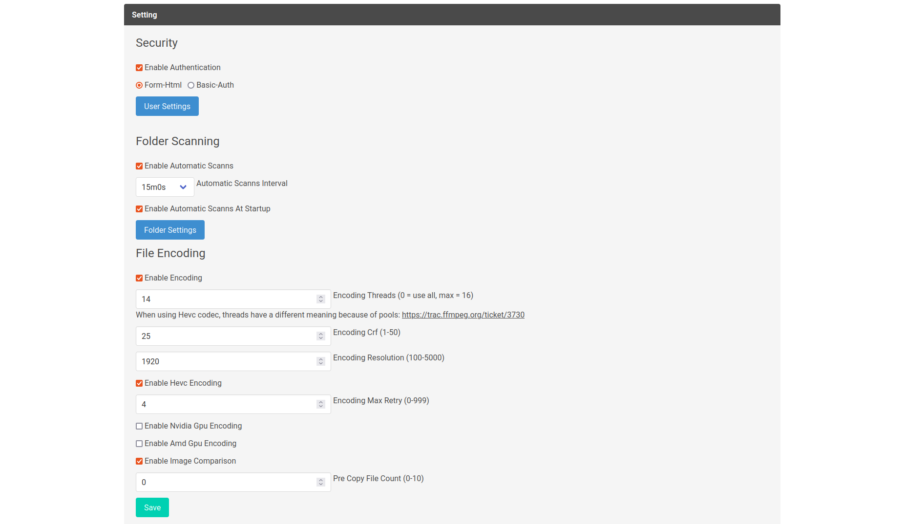

# Convertarr


<!--  -->

[](https://golang.org/)
[](https://www.gnu.org/licenses/gpl-3.0)
[](https://hub.docker.com/r/kirari04/convertarr)

Convertarr is a powerful, web-based tool designed to automate the process of video conversion. It monitors your specified folders for new video files and encodes them into a more efficient format, saving you valuable storage space without sacrificing quality. With a rich web interface, you can monitor progress, view statistics, and fine-tune every aspect of the encoding process.

## ✨ Features

-   **📊 Interactive Dashboard**:
    -   View live and long-term statistics on server resource usage, including CPU, Memory, and Network I/O.
    -   Track the number of files in the encoding queue and files that are pre-copied for faster processing.
    -   See statistics on the last scan, total files encoded, and total storage saved.

-   **⚙️ Powerful Encoding Engine**:
    -   Choose between H.264 and the highly efficient **HEVC (H.265)** codec.
    -   Fine-tune video quality with adjustable **CRF (Constant Rate Factor)** and output resolution.
    -   **Hardware Acceleration**: Offload encoding to your GPU for significantly faster performance.
        -   NVIDIA **(NVENC)** support.
        -   AMD **(VAAPI)** support for Linux.
    -   Control the number of CPU threads used for encoding.

-   **🗂️ Folder & File Management**:
    -   Add and manage multiple folders for Convertarr to monitor.
    -   Enable automatic periodic scanning (with configurable intervals) and scanning on startup.
    -   Trigger a folder scan manually at any time from the UI.
    -   **Workflow Optimization**: Pre-copy files to a local temp directory to speed up the encoding pipeline.

-   **🔐 Security**:
    -   Secure your instance with optional user authentication.
    -   Supports both **Form-Based** login and **HTTP Basic Auth**.
    -   Easily manage user credentials.

-   **📜 History & Quality Control**:
    -   View a detailed history of all encoded files.
    -   The history table automatically refreshes to show the latest progress.
    -   **Image Comparison**: Generate a side-by-side comparison image of the original and encoded file to easily verify quality.

## 🚀 Install using Docker

```bash
docker run -d \
  --name=convertarr \
  -e PUID=1000 \
  -e PGID=1000 \
  -e TZ=Etc/UTC \
  -p 8080:8080 \
  -v /path/to/data:/app/database \
  -v /path/to/comparisonimages:/app/img \
  -v /path/to/videofiles:/videofiles \
  --restart unless-stopped \
  kirari04/convertarr:latest
```

or using docker-compose

```yaml
---
services:
  convertarr:
    image: kirari04/convertarr:latest
    container_name: convertarr
    environment:
      - PUID=1000
      - PGID=1000
      - TZ=Etc/UTC
    volumes:
      - /path/to/data:/app/database
      - /path/to/comparisonimages:/app/img
      - /path/to/videofiles:/videofiles
    ports:
      - 8080:8080
    restart: unless-stopped
```

## 🔧 Configuration

Once the container is running, access the web UI at `http://<your-server-ip>:8080`.

1.  On the first run, you will be guided through an initial setup wizard to configure your administrator user and authentication settings.
2.  All further configuration, including adding media folders and tuning encoding settings, is done through the **Settings** page in the web UI.

## 🛠️ Developement

### Server Application

```bash
make dev
```

### Watch Templ

```bash
templ generate --watch
```
### Build

```bash
docker build --platform linux/amd64 -t kirari04/convertarr:latest --push .

sudo docker buildx build  --platform linux/amd64 -t kirari04/convertarr:latest --sbom=true --provenance=true --push .
```

