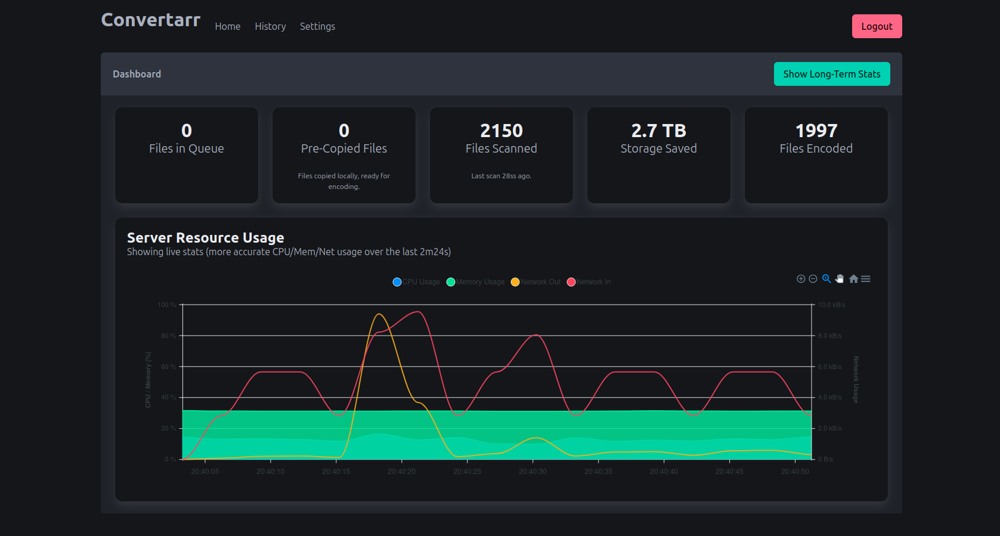

# Convertarr



## Server Application

```bash
go run main.go serve
```

## Watch Templ

```bash
templ generate --watch
```

## Docker 

### Build

```bash
docker build --platform linux/amd64 -t kirari04/convertarr:latest --push .
```

### On System

```bash
go build -o main.bin main.go
docker build --platform linux/amd64 -t kirari04/convertarr:latest --push -f Dockerfile.main
```