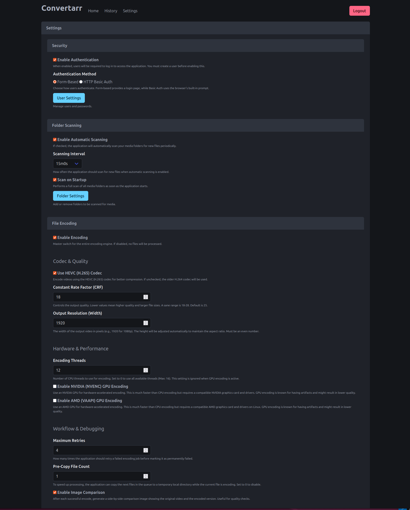

# Convertarr




## Install using Docker

```bash
docker run -d \
  --name=convertarr \
  -e PUID=1000 \
  -e PGID=1000 \
  -e TZ=Etc/UTC \
  -p 8080:8080 \
  -v /path/to/data:/app/database \
  -v /path/to/comparisonimages:/app/img \
  -v /path/to/videofiles:/videofiles \
  --restart unless-stopped \
  kirari04/convertarr:latest
```

or using docker-compose

```yaml
---
services:
  convertarr:
    image: kirari04/convertarr:latest
    container_name: convertarr
    environment:
      - PUID=1000
      - PGID=1000
      - TZ=Etc/UTC
    volumes:
      - /path/to/data:/app/database
      - /path/to/comparisonimages:/app/img
      - /path/to/videofiles:/videofiles
    ports:
      - 8080:8080
    restart: unless-stopped
```

## Developement

### Server Application

```bash
make dev
```

### Watch Templ

```bash
templ generate --watch
```
### Build

```bash
docker build --platform linux/amd64 -t kirari04/convertarr:latest --push .
```